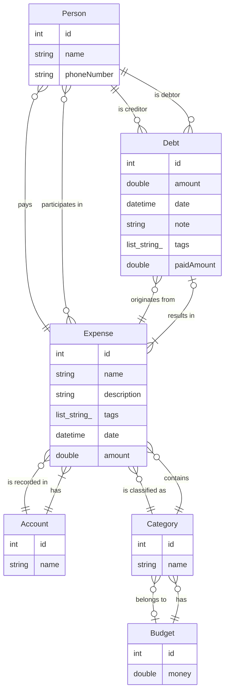

# expensetracker
### TODO
1. Division of database-per year?
   Handle loading and unloading of databases, invalidate cache.

1. Autopay
   Enum for custom timers
   List of expenses that is to be repeated for this
   Autopay list - contains all autopays and last rupdate time.

1. Autopay Generator
   Generator checks date then fills up the expenses till today
   Some kind of timer? For auto triggering generation

1. Virtual expense(?)
   very hard
   Divide single expense for each month/day as needed
<!-- Autogenerated model -->
### Model

<!-- Autogenerated model -->
A new Flutter project.
## Getting Started
This project is a starting point for a Flutter application.

A few resources to get you started if this is your first Flutter project:

- [Lab: Write your first Flutter app](https://docs.flutter.dev/get-started/codelab)
- [Cookbook: Useful Flutter samples](https://docs.flutter.dev/cookbook)

For help getting started with Flutter development, view the
[online documentation](https://docs.flutter.dev/), which offers tutorials,
samples, guidance on mobile development, and a full API reference.
