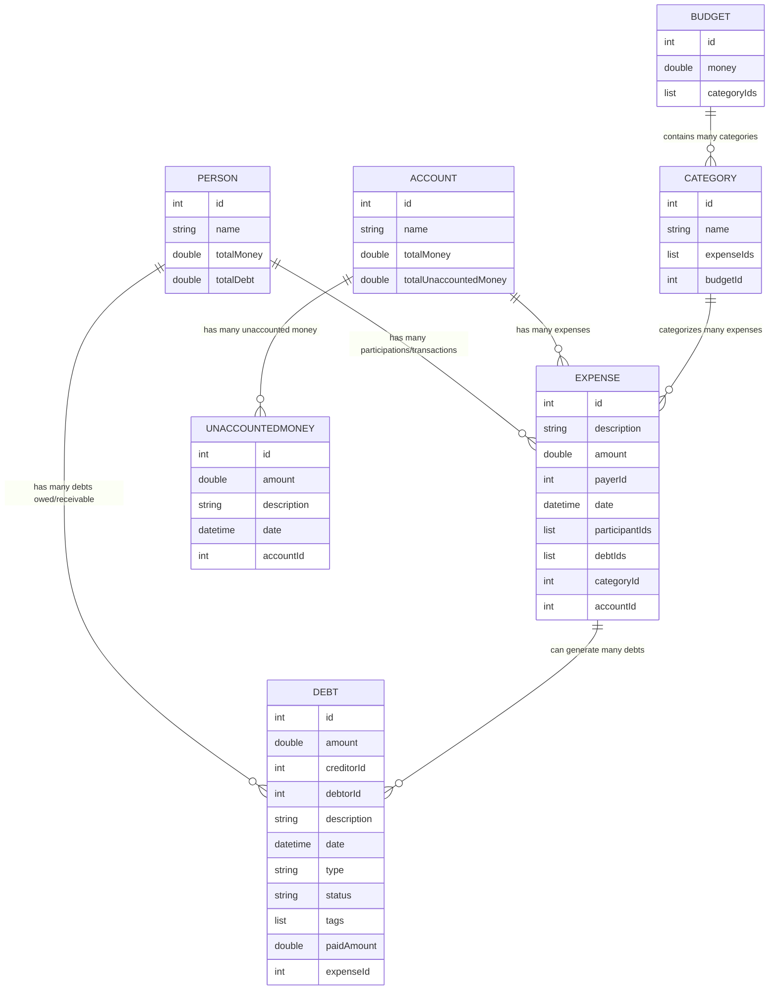

# Model Connections

This diagram illustrates the relationships between the core data models in the expense tracker application.

```mermaid
erDiagram
    PERSON ||--o{ DEBT : "has many debts owed/receivable"
    PERSON ||--o{ EXPENSE : "has many participations/transactions"
    ACCOUNT ||--o{ EXPENSE : "has many expenses"
    ACCOUNT ||--o{ UNACCOUNTEDMONEY : "has many unaccounted money"
    CATEGORY ||--o{ EXPENSE : "categorizes many expenses"
    BUDGET ||--o{ CATEGORY : "contains many categories"
    EXPENSE ||--o{ DEBT : "can generate many debts"

    PERSON {
        int id
        string name
        double totalMoney
        double totalDebt
    }

    ACCOUNT {
        int id
        string name
        double totalMoney
        double totalUnaccountedMoney
    }

    DEBT {
        int id
        double amount
        int creditorId
        int debtorId
        string description
        datetime date
        string type
        string status
        list tags
        double paidAmount
        int expenseId
    }

    EXPENSE {
        int id
        string description
        double amount
        int payerId
        datetime date
        list participantIds
        list debtIds
        int categoryId
        int accountId
    }

    BUDGET {
        int id
        double money
        list categoryIds
    }

    CATEGORY {
        int id
        string name
        list expenseIds
        int budgetId
    }

    UNACCOUNTEDMONEY {
        int id
        double amount
        string description
        datetime date
        int accountId
    }
```
